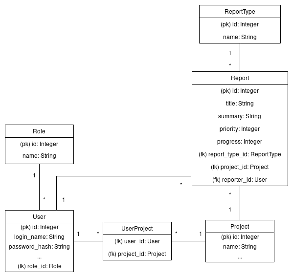

# Database application: bug reports and feature requests tracking

Even though there exists a myriad of bug trackers and feature request systems,
including the current home of this project itself (Github), I've decided to
implement one as an excercise.

The application will have user registration and login, user roles (developer
and user for now), projects which the reports will concern, reports with types
(bug/request), progress-statuses and priorities, keyword-tags for the reports
and basic listing/search which can be sorted by priority, progress and/or age.

