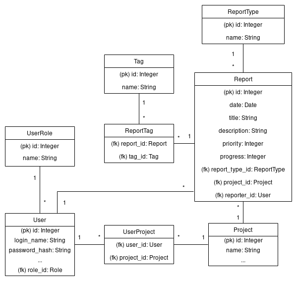

## Database diagram

The main object here is the Report. All Reports have been reported by an user
at some time, have a priority (arbitrarily chosen from 0 which means won't fix
to 10 which means critical), have a progress (again, arbitrarily 0 means not
started, 10 means done), can have tags, and concern only some Project.

For the sake of simplicity and to encourage everyone to have a try, I've chosen
not to have assignees for Reports.
